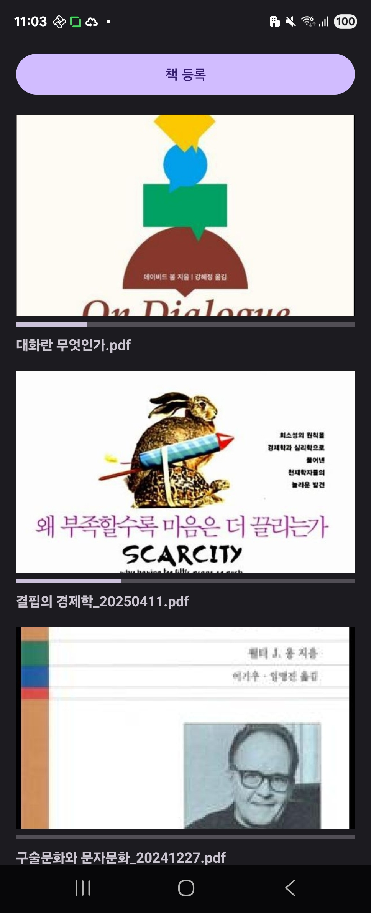
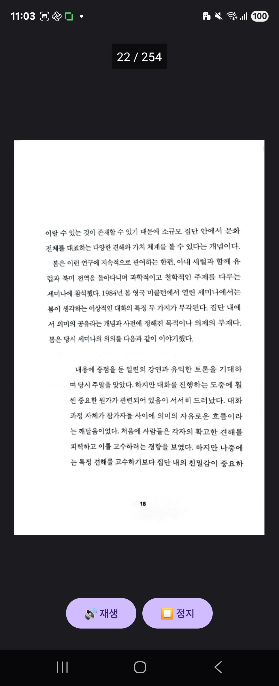

# 📚 BookPlay

**BookPlay**는 PDF 책을 등록하고, 목록으로 관리하며, 페이지를 음성으로 읽어주는 Android 앱입니다.  
향후 TTS(Text-to-Speech) 기능과 설정 기능까지 포함한 **책 낭독 도우미 앱**을 목표로 개발 중입니다.
여기에 있는 내용은 공개된 내용이고 추후 단계들은 비공개로 진행하려고 합니다.

---

## ✨ 주요 기능

| 기능 | 설명 |
|------|------|
| 📄 PDF 등록 | 파일 선택(File Picker)으로 PDF 책을 앱에 등록 |
| 🖼 썸네일 표시 | PDF 첫 페이지를 썸네일로 추출해 목록에 표시 |
| 📚 책 목록 | 등록된 책을 리스트로 보여주고, 진행률도 표시 |
| 🗂 Room DB 저장 | 등록된 책 정보는 앱 내 DB에 저장되어 유지 |
| ✅ PDF 보기 | 책을 열어 실제 내용을 페이지 단위로 확인 가능 |
| 🔊 TTS 낭독 | 페이지 내용을 음성으로 읽어주는 기능 추가 예정 |
| ⚙️ (예정) TTS 설정 | 기기 기본 TTS vs 온라인 TTS 선택 가능하게 구성 예정 |

---

## 📂 프로젝트 구조

``` bash
com.blacktiger.bookplay
├── MainActivity.kt
├── adapter/
├── data/
├── util/
└── res/
```

## 🛠 기술 스택
- 언어: Kotlin
- UI 프레임워크: Android View System (ConstraintLayout, RecyclerView)
- 로컬 데이터 저장: Room (SQLite)
- 이미지 처리: Glide
- PDF 렌더링: PdfRenderer (Android SDK 내장)
- 음성 출력: Android TextToSpeech API (예정), OpenAI TTS API (예정)

## 🚧 개발 로드맵
- [X] 1단계: PDF 등록 및 목록 표시
- [X] 2단계: PDF 보기 화면 구성
- [X] 3단계: TTS 기능 추가 (기기 기본 TTS)
- [X] 4단계	책 삭제 및 읽은 페이지 저장, 앱 재시작 시 마지막 위치 복원 (이어읽기)
- [X] 5단계	페이지 수 및 진도 표시 (5 / 134), TTS 낭독 완료 시 자동 페이지 전환
- [ ] 6단계	백그라운드 낭독 지원 (Foreground Service 등)
- [ ] 7단계	설정 화면에서 TTS 방식 선택

## 📸 스크린샷
▶ [Facebook Video](https://www.facebook.com/share/v/162RyBjF7A/)

▶ 책 목록(MainActivity)


▶ PDF Reader (PdfReaderActivity)


## 📦 빌드 방법
- Android Studio에서 프로젝트 열기
- Gradle Sync 실행
- 실제 Android 기기 또는 에뮬레이터에서 실행

## 🪪 라이선스
TBD

# 🙋‍♂️ 개발자
- 닉네임: blcktgr
- 📧 연락처: blcktgr73@gmail.com


